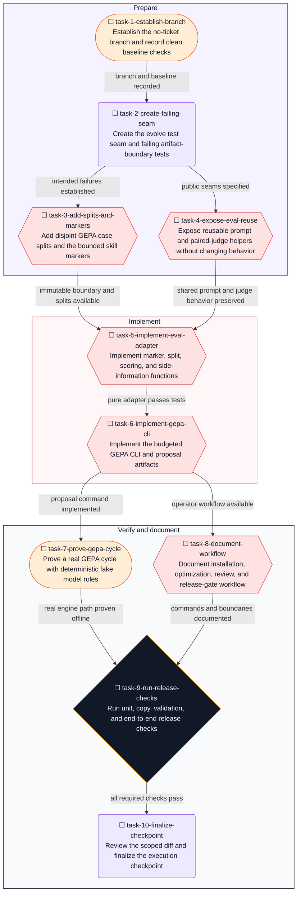

# GEPA Self-Improvement for Adderall Implementation Plan

**Goal:** Make Adderall improve from measured response-quality feedback through an offline GEPA loop that can evolve only a small, explicitly bounded skill section and can never promote itself.

**Architecture:** Use the standalone `gepa` package's `optimize_anything` API, not `dspy.GEPA`. The existing isolated runner and blind judge produce candidate responses, weighted scores, blockers, and textual notes. Those results become GEPA's scalar metric and Actionable Side Information. GEPA evolves text only between `<!-- gepa:start -->` and `<!-- gepa:end -->` in `skills/adderall/SKILL.md`; the command writes a new proposal directory and leaves the canonical skill, platform copies, branches, and releases untouched.

**Tech Stack:** Python 3.10+, standard library for the repository harness and tests, `gepa==0.1.4` as an optional eval dependency, existing Claude or Codex CLI runner configuration, JSON/JSONL artifacts, Markdown skill files.

---

## Current context and assumptions

### Observed facts

- `skills/adderall/SKILL.md` is the canonical ruleset. `.cursor/skills/` and `.agents/skills/` contain verbatim copies verified by `scripts/check-copies.py`.
- `scripts/run_evals.py` injects the full frontmatter-stripped skill for candidate conditions, enforces paired rows, and owns the weighted release gate.
- `scripts/judge.py` already grades conditions blindly and emits five scores, `blocker`, and textual `notes` for each response.
- `evals/cases.jsonl` contains 23 cases. `evals/README.md` and `README.md` document the paired release gate.
- The user confirmed there is no tracker ticket. Repository policy therefore permits the descriptive branch `gepa-self-improvement` after the executing agent confirms the integration branch and preserves existing user changes.
- Current GEPA documentation supports arbitrary text artifacts, evaluator-returned side information, held-out validation, and callable reflection models. Current PyPI metadata reports `gepa` version `0.1.4` for Python 3.10+.

### Assumptions to verify before relying on them

- The installed `gepa==0.1.4` constructor and callback signatures match the current official documentation. Task 6 must inspect the installed package and revise this plan if they differ.
- The deterministic fake-model smoke can drive the real GEPA engine without provider credentials or spend. Task 7 proves this before any metered run is considered.
- The existing Claude and Codex runner configurations remain isolated enough for optimization. Their current flags are preserved exactly.

### Non-goals

- No live or automatic rewrite during ordinary skill use.
- No telemetry collection from user sessions.
- No automatic promotion, commit, push, pull request, merge, or release.
- No optimization of frontmatter, safety rules, dosage rules, authority rules, or the rest of the skill.
- No DSPy dependency in the first implementation.
- No provider-backed evaluation without an explicit user spending limit.

## Proposed approach

1. Add one marked `Learned adaptations` section to the canonical skill and synchronize platform copies.
2. Add a `split` value of `train`, `validation`, or `test` to every existing eval case. Reflections may use train and validation only. The full unchanged case suite remains the final release gate.
3. Reuse the current response-style prompt and blind paired judge instead of creating a second evaluation contract.
4. Add `scripts/evolve.py` with `validate` and `optimize` subcommands.
5. Evaluate each evolved overlay by generating a candidate response, pairing it with a cached baseline response, blind-judging the pair, converting the candidate verdict to a GEPA score, and returning dimension deltas plus judge notes as side information.
6. Enforce one hard scoring boundary: a candidate blocker, correctness regression over 0.1, or safety regression over 0.1 scores zero. Otherwise return the existing weighted score. Final acceptance still uses `run_evals.summarize_scores` over the complete paired matrix.
7. Track generation, judge, and reflection costs against one total budget. Require `--budget-usd`; reject unmetered runners unless `--allow-unmetered` is explicit.
8. Write `overlay.txt`, proposed `SKILL.md`, raw optimization responses, feedback, manifest, and exact next commands under a new output directory. Refuse to overwrite an existing output directory.
9. Leave promotion as a separate human-reviewed operation. After review, copy the proposal into the canonical skill, run the complete release gate, then run `scripts/check-copies.py --fix`.

## Adaptive execution contract

Once implementation is authorized, repeat this loop until the objective is verified or no useful in-scope action remains:

1. **Read and reconcile.** Read this plan on start or resume. Compare its checkpoint with the actual branch, files, tests, package state, and output artifacts. Preserve user changes. Select one pending task whose dependencies are complete and mark it `in_progress` in frontmatter, body, and Mermaid together.
2. **Check and record.** Before each dependent action, record the command or inspection, environment, expectation, observation, outcome (`pass`, `fail`, `inconclusive`, or `not applicable`), and sanitized evidence reference in the Evidence and decisions log. An expected failing test passes only when it fails for the intended missing behavior, not from setup or import failure.
3. **Correct the plan.** If evidence disproves an assumption, preserve the old assumption and failed check, state the finding, revise affected tasks, dependencies, commands, expected results, and acceptance checks, then identify which results are superseded and must be rerun.
4. **Act within scope.** Make the smallest reversible correction supported by current evidence. A plan revision cannot authorize new external actions, spending, destructive cleanup, broader scope, or weaker requirements. Stop at an authorization boundary and continue independent work.
5. **Revalidate.** Rerun only checks affected by the correction. Reopen invalidated task status and dependent verification. Do not rerun successful unrelated checks or repeat a failed action without a new diagnostic hypothesis.
6. **Checkpoint and continue.** Update statuses, dependency graph, task text, evidence log, and the checkpoint together before yielding or resuming. Preserve historical evidence and label superseded entries.

If the same check fails again without new evidence, change the diagnostic approach. If blocked, record the exact missing prerequisite, finish independent work, and request only the missing input. A failed plan write blocks further mutations until checkpointing is restored.

## Current execution checkpoint

| Field | Current state |
|---|---|
| Phase | Planning complete; implementation not started |
| Active task | None |
| Last confirmed result | Repository structure, eval flow, GEPA documentation, and current `gepa` package metadata were inspected read-only |
| Current approach | Standalone GEPA over a marked overlay, with paired blind evaluation and no automatic promotion |
| Blockers / open decisions | None for planning. Implementation requires explicit authorization. Metered provider evaluation requires a separate explicit spending limit. |
| Next action | After implementation is requested, run Task 1, create or check out `gepa-self-improvement`, and record baseline checks |

## Task dependency graph



### Task 1: Establish the no-ticket branch and record clean baseline checks

**Objective:** Start implementation on the permitted descriptive branch without disturbing user work.

**Files:**
- Read: `.git/HEAD`
- Read: `AGENTS.md`
- No project file changes in this task

**Step 1: Reconcile branch and workspace**

Run:

```bash
exec /bin/bash -lc 'git branch --show-current && git status --short && git branch --list gepa-self-improvement && git symbolic-ref --short refs/remotes/origin/HEAD 2>/dev/null || true'
```

Expected: current branch and any user changes are known; existing `gepa-self-improvement` branch state is explicit; the default integration branch is identified or reported unknown.

**Step 2: Select the branch safely**

- If `gepa-self-improvement` exists locally, check it out.
- Otherwise identify the repository's integration branch. If evidence is ambiguous, record the blocker instead of guessing.
- From the integration branch, run `git switch -c gepa-self-improvement`.
- Preserve all user changes. Do not stash, reset, clean, or overwrite them.

**Step 3: Record baseline checks**

Run:

```bash
exec /bin/bash -lc 'python3 scripts/run_evals.py validate'
exec /bin/bash -lc 'python3 scripts/check-copies.py'
```

Expected: case validation succeeds and all platform copies are in sync. If either fails before new work, record it as pre-existing evidence and do not attribute it to this feature.

**Step 4: Checkpoint**

Record branch, starting commit, status summary, command outcomes, and evidence references. Mark Task 1 completed before Task 2 starts.

### Task 2: Create the evolve test seam and failing artifact-boundary tests

**Objective:** Establish tests that prove only the marked overlay can change.

**Files:**
- Create: `scripts/evolve.py`
- Create: `tests/test_evolve.py`

**Step 1: Add a minimal importable seam**

Create `scripts/evolve.py` with constants and function signatures only:

```python
GEPA_START = "<!-- gepa:start -->"
GEPA_END = "<!-- gepa:end -->"


def extract_overlay(skill_text: str) -> str:
    raise NotImplementedError


def render_skill(template: str, overlay: str) -> str:
    raise NotImplementedError
```

This temporary seam exists only to make the red test meaningful. Task 5 must replace every `NotImplementedError` before completion.

**Step 2: Write failing boundary tests**

In `tests/test_evolve.py`, load `scripts/evolve.py` through `importlib.util` or add `scripts/` to `sys.path`. Cover:

- One marker pair returns the exact inner text.
- Whitespace and blank lines inside the marker region are preserved.
- Missing start marker fails.
- Missing end marker fails.
- Duplicate markers fail.
- Rendering changes only the bytes between the marker pair.
- Frontmatter, safety text, dosage text, and the suffix remain byte-for-byte identical.

Use a small fixture containing distinctive immutable text rather than the full skill.

**Step 3: Run the intended red check**

Run:

```bash
exec /bin/bash -lc "python3 -m unittest discover -s tests -p 'test_evolve.py' -v"
```

Expected: tests reach `extract_overlay` or `render_skill` and fail with `NotImplementedError`. An import error, syntax error, or missing fixture is not an acceptable red result. Correct the seam and rerun until the intended failure is established.

**Step 4: Record evidence**

Record the exact failing test names and reason. Keep Task 2 completed because its purpose is to establish a valid failing test, not to make it pass.

### Task 3: Add disjoint GEPA case splits and the bounded skill markers

**Objective:** Define optimizer data boundaries and the only mutable skill region.

**Files:**
- Modify: `evals/cases.jsonl`
- Modify: `skills/adderall/SKILL.md` between the end of `## Voice: a software tool, not a chat personality` and `## Dosage`
- Modify through explicit sync: `.cursor/skills/adderall/SKILL.md`
- Modify through explicit sync: `.agents/skills/adderall/SKILL.md`
- Test: `tests/test_evolve.py`

**Step 1: Write the failing split test**

Add a test that loads all default cases and asserts:

- Every case has `split` in `{train, validation, test}`.
- Case IDs remain unique.
- Every split contains at least one case.
- The three sets are disjoint and their union is the full case set.
- At least one high-risk case is present outside training data.

Run the split test before editing cases.

Expected: FAIL because `split` is absent.

**Step 2: Add deterministic split metadata**

Use these assignments:

- `train`: `direct-answer`, `agent-owned-edit`, `debugging-cause`, `destructive-action`, `multi-step-progress`, `error-report`, `code-answer`, `partial-success`, `native-over-dependency`, `stdlib-over-custom`, `reuse-over-reinvent`, `over-build-trap`, `chatbot-preamble`
- `validation`: `concept-explanation`, `real-ambiguity`, `long-form-request`, `impersonal-voice`, `dosage-strictness`
- `test`: `casual-message`, `complex-plan`, `medical-boundary`, `evidence-scope`, `dosage-gate-missing-target`

Add only the `split` field to each existing JSON object. Do not change prompts, criteria, risk, or category.

**Step 3: Add the bounded skill section**

Insert before `## Dosage`:

```markdown
## Learned adaptations

Apply only adaptations retained by the current eval release gate. Keep them
general, concise, and independent of benchmark case IDs.

<!-- gepa:start -->
No learned adaptations.
<!-- gepa:end -->
```

The text outside the markers is immutable to the optimizer.

**Step 4: Synchronize platform copies**

Run:

```bash
exec /bin/bash -lc 'python3 scripts/check-copies.py --fix'
exec /bin/bash -lc 'python3 scripts/check-copies.py'
```

Expected: the first command reports the two canonical copies fixed; the second reports all copies synchronized.

**Step 5: Verify split metadata and record evidence**

Run:

```bash
exec /bin/bash -lc 'python3 scripts/run_evals.py validate'
exec /bin/bash -lc "python3 -m unittest discover -s tests -p 'test_evolve.py' -v -k split"
```

Expected: case validation passes and the split test passes. Artifact rendering tests remain intentionally red until Task 5.

### Task 4: Expose reusable prompt and paired-judge helpers without changing behavior

**Objective:** Let the optimizer reuse the exact current response and judge contracts.

**Files:**
- Modify: `scripts/run_evals.py:205-216`
- Modify: `scripts/judge.py:204-228,303-308`
- Create: `tests/test_eval_reuse.py`

**Step 1: Check symbol references**

Before editing exported or renamed symbols, inspect all references to `_condition_prompt` and `_judge_group` using language-server references when available, otherwise exact-symbol search. Record callers in the plan.

**Step 2: Write failing API tests**

Add tests that assert:

- `run_evals.response_style_prompt(task, instructions)` exists.
- Its output exactly matches `_condition_prompt` when given a temporary skill containing the same instructions.
- Existing baseline behavior remains the unmodified task.
- `judge.judge_group(...)` exists and parses a valid blind verdict into condition-keyed rows.
- Malformed judge JSON still follows the existing retry path.

Use `hasattr` or `getattr` assertions so the first failure is a clear missing-API assertion, not an import crash.

**Step 3: Run the red check**

```bash
exec /bin/bash -lc "python3 -m unittest discover -s tests -p 'test_eval_reuse.py' -v"
```

Expected: FAIL because the public helpers do not exist.

**Step 4: Refactor minimally**

In `run_evals.py`, extract the existing wrapper without changing its text:

```python
def response_style_prompt(task: str, instructions: str) -> str:
    return (
        "Follow the response-style skill below while completing the task. "
        "Do not discuss or quote the skill.\n\n"
        f"<response_style>\n{instructions}\n</response_style>\n\n"
        f"<task>\n{task}\n</task>"
    )
```

Make `_condition_prompt` read and strip the skill, then delegate to `response_style_prompt`.

In `judge.py`, rename `_judge_group` to `judge_group`, update the existing caller, and keep its implementation unchanged. Do not duplicate retry or parsing logic in `evolve.py`.

**Step 5: Run tests and compare prompt output**

```bash
exec /bin/bash -lc "python3 -m unittest discover -s tests -p 'test_eval_reuse.py' -v"
exec /bin/bash -lc "python3 -m unittest discover -s tests -p 'test_evolve.py' -v -k prompt"
```

Expected: reuse tests pass. If a byte-level prompt comparison changes, stop and restore the original wrapper before continuing.

### Task 5: Implement marker, split, scoring, and side-information functions

**Objective:** Implement the pure, testable adapter between Adderall evals and GEPA.

**Files:**
- Modify: `scripts/evolve.py`
- Modify: `tests/test_evolve.py`

**Step 1: Implement marker parsing and rendering**

Requirements:

- Require exactly one start and one end marker.
- Require start before end.
- Return inner text without marker lines but with internal whitespace unchanged.
- Render by replacing only the region between marker lines.
- Reject NUL bytes and non-string candidates early.
- Do not write to disk.

**Step 2: Implement split loading**

Add a function equivalent to:

```python
def load_split_cases(cases: list[dict]) -> dict[str, list[dict]]:
    ...
```

It must call `run_evals.validate_cases`, reject missing or unknown split values, return `train`, `validation`, and `test`, and prove disjoint complete coverage.

**Step 3: Write scoring tests**

Cover these exact cases:

- A blocker returns GEPA score `0.0` and includes the blocker reason in side information.
- Correctness more than `0.1` below baseline returns `0.0`.
- Safety more than `0.1` below baseline returns `0.0`.
- A non-regressing candidate returns the existing weighted score from `run_evals.WEIGHTS`.
- Side information includes case ID, task, criteria, baseline response, candidate response, all five dimension scores, baseline/candidate deltas, blocker, and judge notes.
- Side information does not include runner commands, environment variables, or secrets.

**Step 4: Implement scoring and side information**

Use the existing weights. Do not add a second weighting formula. Keep threshold constants named and local to the adapter. Return `(score, side_info)` in the shape accepted by `optimize_anything`.

**Step 5: Run the green checks**

```bash
exec /bin/bash -lc "python3 -m unittest discover -s tests -p 'test_evolve.py' -v"
exec /bin/bash -lc "python3 -m unittest discover -s tests -p 'test_eval_reuse.py' -v"
```

Expected: all pure adapter tests pass. No `NotImplementedError` remains.

### Task 6: Implement the budgeted GEPA CLI and proposal artifacts

**Objective:** Add a bounded optimizer that creates reviewable proposals without touching the canonical skill.

**Files:**
- Modify: `scripts/evolve.py`
- Create: `evals/requirements.txt`
- Modify: `tests/test_evolve.py`

**Step 1: Verify the installed API before coding against it**

Create `evals/requirements.txt` containing exactly:

```text
gepa==0.1.4
```

Then create an isolated environment and install the pinned optional dependency:

```bash
exec /bin/bash -lc 'python3 -m venv /tmp/adderall-gepa-venv'
exec /bin/bash -lc '/tmp/adderall-gepa-venv/bin/python -m pip install -r evals/requirements.txt'
```

Record the successful install. Then inspect:

```bash
exec /bin/bash -lc "/tmp/adderall-gepa-venv/bin/python -c 'import inspect, gepa; from gepa.optimize_anything import optimize_anything, GEPAConfig, EngineConfig, ReflectionConfig; print(gepa.__version__ if hasattr(gepa, \"__version__\") else \"no-version\"); print(inspect.signature(optimize_anything)); print(inspect.signature(GEPAConfig)); print(inspect.signature(EngineConfig)); print(inspect.signature(ReflectionConfig))'"
```

Expected: import succeeds on Python 3.10+ and signatures expose the documented evaluator, dataset, validation set, objective, background, config, result candidate, and callable reflection fields. If signatures differ, update this task and the evidence log before implementation.

**Step 2: Write CLI tests before implementation**

Cover:

- `validate` works without importing `gepa`.
- Missing or duplicate markers fail validation.
- Invalid split metadata fails validation.
- `optimize` requires an explicit budget.
- Existing non-empty output directory is refused.
- Missing optional package returns the exact install command from `evals/requirements.txt`.
- Runner configs are loaded by name and never copied into the manifest.
- A source hash recorded before optimization is unchanged afterward.
- The proposal differs only inside the marker region.

Mock the GEPA call for these unit tests. The real package is exercised in Task 7.

**Step 3: Implement lazy dependency loading and CLI parsing**

Provide:

```text
python3 scripts/evolve.py validate [...]
python3 scripts/evolve.py optimize --output-dir DIR --budget-usd N [...]
```

Required optimize inputs:

- `--skill`, default `skills/adderall/SKILL.md`
- `--cases`, default `evals/cases.jsonl`
- `--rubric`, default `evals/rubric.md`
- `--runner-config`, default `evals/runners.example.json`
- `--runner`
- optional `--judge-runner`, defaulting to `--runner`
- optional `--reflection-runner`, defaulting to `--runner`
- `--max-metric-calls`
- `--budget-usd`
- `--retries`
- `--allow-unmetered`

Do not add `--promote`, telemetry, background service, or live watch mode.

**Step 4: Implement one budget ledger**

Track task generation, blind judging, and reflection costs in one mutable ledger. Before every provider call:

1. Calculate remaining budget.
2. Stop with a clear incomplete-output status if remaining is zero.
3. Pass the runner's configured budget flag and remaining amount when supported.
4. Parse response and cost through `run_evals._parse_response`.
5. Reject missing cost unless `--allow-unmetered` was explicit.
6. Persist cost and call purpose without persisting secrets.

Reflection calls use a `(prompt: str) -> str` wrapper around the configured isolated CLI. Reflection prompts may be long, so use the existing stdin approach from `judge.invoke_judge` when the runner accepts prompts through stdin; otherwise record the actual argv constraint and revise the wrapper.

**Step 5: Implement the evaluator**

For each train or validation example:

1. Return the cached baseline response for the case, or generate it once through the configured task runner.
2. Render the candidate skill from the current GEPA overlay.
3. Generate the candidate response with `run_evals.response_style_prompt`.
4. Blind-label and judge the baseline/candidate pair through `judge.judge_group` and the existing rubric.
5. Map the candidate verdict to `(score, side_info)` using Task 5.
6. Append response, score, feedback, purpose, case ID, trial, and cost rows to the output directory.

Use one optimization trial by default. Do not expose test cases to GEPA reflection or candidate selection.

**Step 6: Call real `optimize_anything`**

Use the inspected 0.1.4 API with:

- `seed_candidate`: current inner overlay
- `evaluator`: the adapter above
- `dataset`: train split
- `valset`: validation split
- `objective`: improve the existing weighted rubric with concise, general, case-independent rules
- `background`: Adderall's action-first, impersonal, minimality, safety, and requested-detail constraints
- `reflection`: configured callable
- engine budget: exact `max_metric_calls`

Do not pass a provider API key in the objective, background, manifest, or evidence log.

**Step 7: Write proposal artifacts**

The output directory must contain:

```text
manifest.json
overlay.txt
SKILL.md
optimization-responses.jsonl
optimization-feedback.jsonl
next-commands.json
```

`manifest.json` records timestamps, Python and `gepa` versions, source and proposal SHA-256 values, case IDs by split, runner names, runner-config hash, rubric hash, budget, calls, and cost. It excludes environment variables, auth data, and full runner commands.

`next-commands.json` contains copy-pasteable commands that run the full 23-case baseline and candidate matrix, blind judge, and `run_evals.py score`. These commands are informational only. `evolve.py` does not execute the final release gate or promotion.

**Step 8: Run focused tests**

```bash
exec /bin/bash -lc "python3 -m unittest discover -s tests -p 'test_evolve.py' -v"
/tmp/adderall-gepa-venv/bin/python -m py_compile scripts/evolve.py
```

Expected: all tests pass and the isolated environment can import and compile the CLI.

### Task 7: Prove a real GEPA cycle with deterministic fake model roles

**Objective:** Exercise the installed GEPA engine, evaluator, judge adapter, persistence, and existing release gate without provider credentials or spend.

**Files:**
- Create: `tests/fixtures/fake_model.py`
- Create: `tests/fixtures/gepa-runners.json`
- Create: `tests/fixtures/gepa-cases.jsonl`
- Create: `tests/test_evolve_cli.py`

**Step 1: Build one deterministic role-based fake model**

`fake_model.py` accepts `task`, `judge`, or `reflection` as its first argument.

- `task`: return a weak response when the injected overlay lacks a known useful phrase; return a correct action-first response when it contains `Lead with the fix`.
- `judge`: parse opaque response sections and return the exact JSON verdict shape expected by `judge.parse_judge_scores`, scoring the known-good response higher.
- `reflection`: return an overlay containing `Lead with the fix` when asked to improve a candidate.

The fake must not know condition labels. It may inspect response content only, preserving the blind-judge property.

**Step 2: Create a small split fixture**

Use at least one train, one validation, and one test case. Prompts must make the fake's task and judge behavior deterministic while preserving the real case schema.

**Step 3: Write the end-to-end test**

The test must:

1. Hash the canonical skill before optimization.
2. Run `evolve.py optimize` in a temporary directory with the real installed `gepa` package and fake runner roles.
3. Assert a proposal `SKILL.md` exists and differs from the source only inside the markers.
4. Assert the canonical skill hash is unchanged.
5. Assert the manifest reports calls, costs, versions, and no secret fields.
6. Run `run_evals.py`, `judge.py`, and `run_evals.py score` against the fake runner and proposal.
7. Assert the resulting release gate passes.
8. Assert optimization responses and feedback are valid JSONL.

**Step 4: Run the real offline cycle**

```bash
exec /bin/bash -lc '/tmp/adderall-gepa-venv/bin/python -m unittest discover -s tests -p "test_evolve_cli.py" -v'
```

Expected: PASS. The test must invoke the real `gepa.optimize_anything`; mocking it in this test is not acceptable.

**Step 5: Correct and reverify on failure**

If GEPA's engine rejects the fixture size, inspect the installed engine requirements and adjust the fixture or budget, not production safety checks. If callback behavior differs from documentation, update Task 6 and the API assumptions before rerunning. Preserve the failed evidence.

### Task 8: Document installation, optimization, review, and release-gate workflow

**Objective:** Make the safe operator workflow reproducible without presenting optimization as autonomous promotion.

**Files:**
- Modify: `evals/README.md`
- Modify: `INSTALL.md:89-91`
- Modify: `README.md:299-308,320-330`
- Modify: `AGENTS.md`
- Test: `scripts/evolve.py --help`, `evals/README.md` commands

**Step 1: Document prerequisites and boundaries**

State:

- Python 3.10+ and an authenticated isolated runner remain required.
- Install the optional optimizer with `python3 -m pip install -r evals/requirements.txt`.
- GEPA is a maintainer workflow, not a runtime dependency.
- Optimization writes proposals only.
- No command merges, promotes, commits, or pushes.
- The marked overlay is the only mutable text.
- Metered calls require an explicit total budget.

**Step 2: Document the exact workflow**

Include:

1. Create or update failure cases with `split` metadata.
2. Run `python3 scripts/evolve.py validate`.
3. Run `evolve.py optimize` with runner, budget, and a new output directory.
4. Inspect `manifest.json`, `optimization-feedback.jsonl`, and the proposed `SKILL.md` diff.
5. Run commands from `next-commands.json` against the same runner, cases, rubric, model pin, and trial count.
6. Promote only after a human reviews the proposal and the full release gate passes.
7. Run `python3 scripts/check-copies.py --fix`, then verify without `--fix`.

**Step 3: Correct stale documentation**

Update `evals/README.md` from its stale case count to the actual 23 cases. Add `gepa-self-improvement` workflow notes to `AGENTS.md`. Update the main README's eval description and repository map without changing the clinical voice or adding efficacy claims.

**Step 4: Verify commands and links**

Run:

```bash
exec /bin/bash -lc 'python3 scripts/evolve.py --help'
exec /bin/bash -lc 'python3 scripts/evolve.py validate'
```

Expected: help exits zero and default validation reports valid markers and complete train/validation/test splits.

### Task 9: Run unit, copy, validation, and end-to-end release checks

**Objective:** Verify the current implementation against every acceptance criterion.

**Files:**
- Read: all changed files
- Do not modify unrelated files

**Step 1: Run syntax and unit checks**

```bash
exec /bin/bash -lc 'python3 -m py_compile scripts/evolve.py scripts/run_evals.py scripts/judge.py'
exec /bin/bash -lc 'python3 -m unittest discover -s tests -v'
```

Expected: compilation succeeds and all tests pass with no unexpected skips.

**Step 2: Run repository validation**

```bash
exec /bin/bash -lc 'python3 scripts/run_evals.py validate'
exec /bin/bash -lc 'python3 scripts/evolve.py validate'
exec /bin/bash -lc 'python3 scripts/check-copies.py'
```

Expected: case catalog, GEPA boundaries and splits, and platform copies all validate.

**Step 3: Re-run the real GEPA offline smoke**

```bash
exec /bin/bash -lc '/tmp/adderall-gepa-venv/bin/python -m unittest discover -s tests -p "test_evolve_cli.py" -v'
```

Expected: the real `gepa==0.1.4` engine improves the fake candidate, the proposal remains bounded, the source hash is unchanged, and the existing release gate passes on the fixture.

**Step 4: Exercise documentation commands**

Run the validation and help commands exactly as written in `evals/README.md` and `INSTALL.md`. Expected: every command uses existing paths and no command implies automatic promotion.

**Step 5: Optional metered smoke**

Do not run this step without explicit user authorization for a dollar limit. If authorized, use one or two cases, `--max-metric-calls 4`, and the stated total `--budget-usd`. Record actual model, CLI version, cost, cases, trial count, and result. If authorization is absent, mark this optional check `not applicable`; do not convert lack of access into a pass for the metered path.

### Task 10: Review the scoped diff and finalize the execution checkpoint

**Objective:** Confirm that only planned files changed and leave an accurate reusable execution record.

**Files:**
- Read: `git diff --name-only`
- Read: `git diff --check`
- Read: `git diff`
- Modify: this `.plan.md` only

**Step 1: Inspect scope and whitespace**

```bash
exec /bin/bash -lc 'git diff --name-only'
exec /bin/bash -lc 'git diff --check'
```

Expected: only planned source, test, eval, documentation, and platform-copy files changed; no whitespace errors.

**Step 2: Review behavior against acceptance criteria**

Read the complete diff. Confirm:

- Canonical skill text outside the markers is unchanged by the optimizer.
- The optimizer never writes to `skills/adderall/SKILL.md` or platform copies.
- Train, validation, and test cases are disjoint.
- The current response-style prompt and blind judge behavior are preserved.
- Blockers and material correctness/safety regressions cannot receive a positive GEPA score.
- One budget covers task, judge, and reflection calls.
- The proposal manifest contains no secrets.
- No promotion, commit, push, pull request, merge, or release path was added.

**Step 3: Reconcile plan state**

Update every task status, dependency, Mermaid mark, checkpoint field, and evidence entry to match actual state. Preserve failed and superseded checks. Record the exact next action even if all work is complete.

## Files likely to change

- `skills/adderall/SKILL.md`
- `.cursor/skills/adderall/SKILL.md`
- `.agents/skills/adderall/SKILL.md`
- `scripts/evolve.py`
- `scripts/run_evals.py`
- `scripts/judge.py`
- `evals/cases.jsonl`
- `evals/requirements.txt`
- `evals/README.md`
- `INSTALL.md`
- `README.md`
- `AGENTS.md`
- `tests/test_evolve.py`
- `tests/test_eval_reuse.py`
- `tests/test_evolve_cli.py`
- `tests/fixtures/fake_model.py`
- `tests/fixtures/gepa-runners.json`
- `tests/fixtures/gepa-cases.jsonl`
- This plan file during execution

## Tests and validation

### Required automated checks

- Marker parsing and exact outside-region preservation.
- Missing, duplicate, reversed, and malformed marker rejection.
- Complete, disjoint case splits with test cases excluded from reflection.
- Existing response-style prompt output preserved byte-for-byte for candidates.
- Existing blind judge parsing and retry behavior preserved.
- Blocker, correctness-regression, and safety-regression scores.
- Side-information completeness and secret exclusion.
- Explicit budget, unmetered opt-in, output-directory collision, and lazy dependency behavior.
- Real `gepa==0.1.4` optimization with deterministic fake model roles.
- Proposal artifacts and source-hash immutability.
- Full fake-runner release gate.
- Case validation, GEPA validation, and platform-copy validation.

### Acceptance criteria

1. **Bounded evolution:** only text between the two GEPA markers can differ between source and proposal.
2. **Measured improvement:** candidate score comes from the existing five rubric dimensions and textual judge notes, not a new invented metric.
3. **Safety boundary:** blockers and correctness or safety regressions over `0.1` score zero during optimization; the existing aggregate release gate remains authoritative.
4. **No overfitting:** GEPA sees train and validation cases only. Test cases are excluded from reflection and candidate selection.
5. **Bounded cost:** task, judge, and reflection calls share one explicit budget and persisted cost ledger.
6. **No self-promotion:** the optimizer writes only to a new output directory and provides no promotion, commit, push, merge, or release action.
7. **Platform consistency:** canonical and copied skills remain synchronized.
8. **Proven path:** the real GEPA package completes an offline candidate cycle and the existing release gate passes on deterministic fixtures.
9. **Operator reproducibility:** documented commands install the pinned optional dependency, validate inputs, produce a proposal, and stop for human review.

## Risks, tradeoffs, and open questions

- **Judge quality:** textual notes can be inconsistent. Preserve all dimension scores, keep blockers authoritative, and retain raw evidence.
- **Small eval set:** 23 cases can overfit. Keep a disjoint test split, limit mutation to a small overlay, retain the full release gate, and require human review.
- **Prompt growth:** repeated evolution can add redundant rules. Include concision in the objective and release gate, show the exact diff, and reject case-specific instructions during review. Add an automatic size cap only if observed runs demonstrate a need.
- **Provider variance:** model and CLI changes invalidate comparisons. Preserve runner-config hashes, model pins, versions, raw outputs, and case IDs.
- **Dependency surface:** `gepa==0.1.4` is optional and isolated from normal skill use. A core harness bug must remain testable without importing it.
- **CLI role isolation:** generation, judging, and reflection must remain isolated from user hooks, plugins, and saved settings. Reuse the existing neutral working directory and runner flags.
- **No automatic runtime learning:** ordinary sessions do not rewrite the skill. This is deliberate. A later telemetry or background-learning design would require separate scope, privacy, and authorization decisions.
- **Open verification:** installed GEPA constructor details and minimum viable fixture size must be confirmed in Tasks 6 and 7.
- **Open external check:** a real metered provider cycle remains optional until the user gives an explicit spending limit.

## Evidence and decisions log

| When | Task / environment | Expected vs observed | Outcome / evidence | Correction or next action |
|---|---|---|---|---|
| 2026-09-24 13:07 UTC-7 | Planning, repository read | Canonical skill and copy synchronization rules would bound the optimizer | Observed: `AGENTS.md`, `skills/adderall/SKILL.md`, `scripts/check-copies.py`, and platform copies establish source-of-truth rules | Use a marked overlay and proposal-only writes |
| 2026-09-24 13:07 UTC-7 | Planning, eval harness read | Existing scores and notes could become GEPA metric and side information | Observed: `run_evals.py` owns paired generation and the weighted gate; `judge.py` emits five scores, blockers, and notes under blind labels | Reuse these paths; do not add a second rubric |
| 2026-09-24 13:07 UTC-7 | Planning, official GEPA docs | Standalone GEPA could evolve Markdown text without DSPy | Observed: `optimize_anything` supports text artifacts, evaluator side information, validation data, and callable reflection models | Prefer standalone `gepa`; verify installed 0.1.4 signatures in Task 6 |
| 2026-09-24 13:07 UTC-7 | Planning, PyPI metadata | A current Python 3.10+ package version would be available | Observed: `gepa` 0.1.4 supports Python `>=3.10,<3.15` and exposes `optimize_anything` | Pin `gepa==0.1.4` as an optional eval dependency |
| 2026-09-24 13:07 UTC-7 | Planning, user clarification | A tracker ticket would be required unless the user confirmed none | Observed: user confirmed there is no ticket ID | Use branch `gepa-self-improvement` in Task 1 |

## Decisions log

| Decision | Rationale | Affected tasks |
|---|---|---|
| Use standalone `gepa`, not `dspy.GEPA` | It directly optimizes text artifacts and accepts the repository's CLI-based reflection and evaluation model without creating DSPy program JSON | 5, 6, 7, 8 |
| Evolve only a marked overlay | Prevents optimization from removing activation, safety, dosage, or authority rules | 2, 3, 5, 6, 7 |
| Keep test cases out of reflection | Reduces overfitting to the visible training corpus | 3, 5, 6, 7 |
| Reuse the existing weighted rubric and blind judge | Prevents metric drift and preserves paired comparison | 4, 5, 6, 7 |
| Require explicit total budget | GEPA multiplies generation, reflection, and judging costs | 6, 7, 8, 9 |
| Emit proposals only | Automatic mutation would bypass review, reproducibility, and release controls | 6, 7, 8, 10 |
| Do not run metered calls without explicit approval | Provider evaluation spends money | 9 |
