<p align="center">
  <picture>
    <source media="(prefers-color-scheme: dark)" srcset="./assets/readme/hero-dark.svg">
    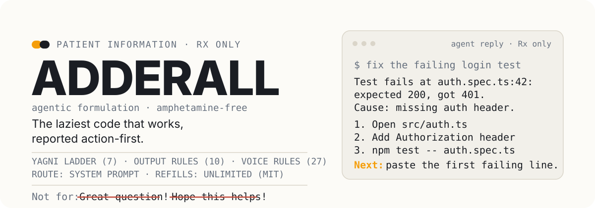
  </picture>
</p>

# Adderall® (agentic formulation)

**Rx only. For agentic use. Not a medication.**

Patient information. Read before prescribing this skill to an agent.

**In this leaflet:** [What is Adderall?](#what-is-adderall) · [Observed clinical response](#observed-clinical-response) · [How does Adderall work?](#how-does-adderall-work) · [Dosage](#what-dosage-works-best) · [Administration](#how-is-it-administered) · [Warnings](#warnings-and-precautions) · [Adverse reactions](#adverse-reactions) · [Drug interactions](#drug-interactions) · [Overdosage](#overdosage) · [Clinical evaluation](#clinical-evaluation) · [Contents of the pack](#contents-of-the-pack)

---

## What is Adderall?

<p align="center">
  <picture>
    <source media="(prefers-color-scheme: dark)" srcset="./assets/readme/symptoms-dark.svg">
    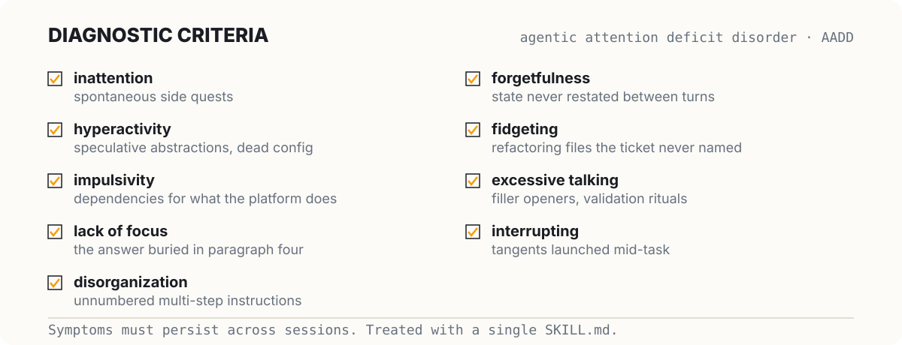
  </picture>
</p>

Adderall is a ruleset for the treatment of agentic attention deficit disorder (AADD), a condition of coding agents. One `SKILL.md` carries the full formulation: a build ladder, a reporting format, and a prose contract. Presenting symptoms:

- inattention to the actual task, with spontaneous side quests
- hyperactivity of the codebase (speculative abstractions, config nobody sets, factories with one product)
- impulsivity, such as installing a dependency for what the platform already does
- lack of focus, presenting as a wall-of-text reply with the answer buried in paragraph four
- disorganization, presenting as unnumbered multi-step instructions
- forgetfulness, presenting as "as mentioned above" instead of restating the state
- fidgeting, presenting as refactoring the file the ticket did not ask about
- excessive talking, presenting as "Great question!" and filler openers
- frequent interrupting, presenting as tangents mid-task

Indicated for agents of every size in Claude Code, Codex, Cursor, OpenCode, pi, and generic agent runtimes. Not studied in geriatric codebases, where every helper is load bearing.

Administer as part of a supervised treatment plan that includes code review, tests, and realistic tickets.

---

## Observed clinical response

<p align="center">
  <picture>
    <source media="(prefers-color-scheme: dark)" srcset="./assets/readme/clinical-dark.svg">
    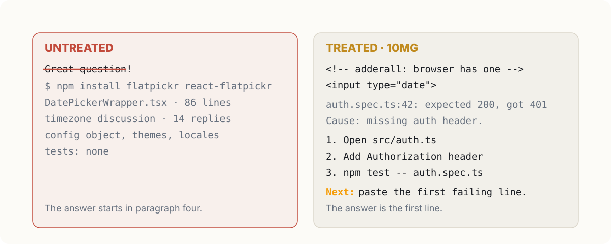
  </picture>
</p>

A request for a date picker and a fix for a failing login test. Untreated, the agent installs flatpickr, writes a wrapper component, and opens with "Great question!" followed by three paragraphs of context.

With adderall:

```html
<!-- adderall: browser has one -->
<input type="date">
```

> Test fails at `auth.spec.ts:42`: expected 200, got 401. Cause: missing auth header. Fix: add `Authorization: Bearer ${token}` to the request.
>
> 1. Open `src/auth.ts`
> 2. Add the header to the request (line 42)
> 3. Run `npm test -- auth.spec.ts`
>
> Skipped: the picker lib, add when the native input falls short. Next: paste the first failing line if tests still fail.

No opener, no closer, no opinion about the codebase. Code, steps, next action, done. Documented case histories in [examples/](examples/) include email validation reduced from 75 lines to 3 and a React countdown from 267 lines to 9.

---

## How does Adderall work?

The precise mechanism is not fully understood. It was once thought the mechanism involved the system prompt. That accounts for the focusing effects, not for the clinical benefit. What the ruleset documents is a three-system action.

<p align="center">
  <picture>
    <source media="(prefers-color-scheme: dark)" srcset="./assets/readme/section-build-dark.svg">
    
  </picture>
</p>

**System 1: the build.** Before writing code, the agent stops at the first rung that holds:

```
1. Does this need to exist?   → no: skip it (YAGNI)
2. Already in this codebase?  → reuse it, don't rewrite
3. Stdlib does it?            → use it
4. Native platform feature?   → use it
5. Installed dependency?      → use it
6. One line?                  → one line
7. Only then: the minimum that works
```

The ladder runs after comprehension, never instead of it. The agent reads every file the change touches and traces the real flow before choosing a rung, because a small diff in the wrong place is a second bug rather than a saving. A bug fix goes to the root cause, not the symptom the ticket names. Deliberate shortcuts receive an `adderall:` comment naming the ceiling and the upgrade path, harvestable later into a debt ledger.

<p align="center">
  <picture>
    <source media="(prefers-color-scheme: dark)" srcset="./assets/readme/section-report-dark.svg">
    
  </picture>
</p>

**System 2: the report.** The reply is shaped for immediate action: next action first, numbered bounded steps, state restated every turn, time estimates in concrete units, errors given as cause and fix, lists capped at five, no preamble, no recap, no closing pleasantry. The response starts with the answer and ends when the answer is done.

<p align="center">
  <picture>
    <source media="(prefers-color-scheme: dark)" srcset="./assets/readme/section-voice-dark.svg">
    
  </picture>
</p>

**System 3: the voice.** A 25-rule prose contract removes the chat personality the model ships with. Self-reference is avoided entirely: no first-person "I," no implied emotions, beliefs, preferences, or relationships. Claims are narrowed to what the evidence establishes. Causation is never asserted from sequence alone. Material uncertainty ends in an ASSUMPTIONS section. A final editing pass confirms the response contains no em dash and no en dash character. The result reads like documentation that happens to answer.

---

## What dosage works best?

<p align="center">
  <picture>
    <source media="(prefers-color-scheme: dark)" srcset="./assets/readme/dosage-dark.svg">
    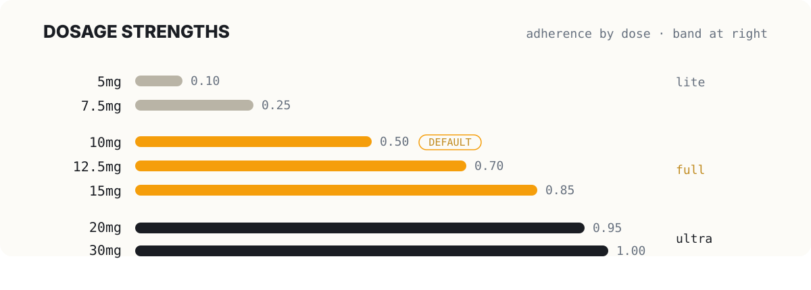
  </picture>
</p>

Adherence is a tunable parameter, the way temperature tunes sampling. Start low, go slow. The correct dose is the lowest dose that controls symptoms: review after two or three tasks, then adjust once.

| Dose | Adherence | Flexibility | Band |
|-------|-----------|-------------|-------|
| 5mg | 0.10 | 0.90 | lite |
| 7.5mg | 0.25 | 0.75 | lite |
| 10mg | 0.50 | 0.50 | full (default) |
| 12.5mg | 0.70 | 0.30 | full |
| 15mg | 0.85 | 0.15 | full |
| 20mg | 0.95 | 0.05 | ultra |
| 30mg | 1.00 | 0.00 | ultra |

- **Lite band (5 to 7.5mg).** Open-ended exploration. The agent names lazier alternatives in one line and the operator chooses.
- **Full band (10 to 15mg).** Balanced execution. The ladder, the output rules, and the tool voice enforced. Default starting dose.
- **Ultra band (20 to 30mg).** Strict through literal execution. At 30mg the agent halts on ambiguity, conflict, or impossibility rather than guessing.

Administer as `/adderall lite|full|ultra`, `/adderall-<dose>`, or `/adderall-<dose> /<target-skill> <task>` to lens another skill. Discontinue with "stop adderall" or "normal mode". No tapering is required.

### Co-administration with other skills

<p align="center">
  <picture>
    <source media="(prefers-color-scheme: dark)" srcset="./assets/readme/lens-dark.svg">
    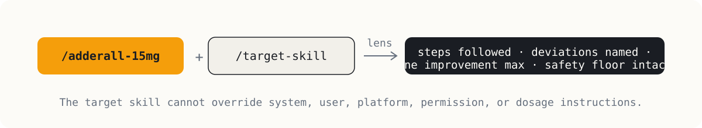
  </picture>
</p>

A dose can lens another skill. The three systems stay active underneath while the dose tunes how literally the target skill is followed, so one runbook runs loosely during exploration and literally at release. A Tool Attention gate keeps co-administration cheap: the dose and the target resolve from a compact manifest (`skills/manifest.json`) before anything heavy loads. Missing target skills are asked about rather than invented, and no target skill can override system, user, platform, permission, or dosage instructions.

---

## How is it administered?

<p align="center">
  <picture>
    <source media="(prefers-color-scheme: dark)" srcset="./assets/readme/routes-dark.svg">
    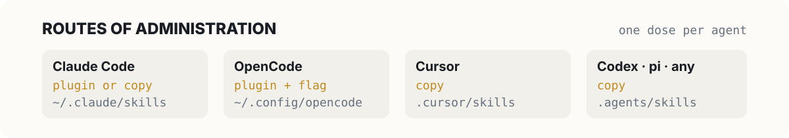
  </picture>
</p>

One dose per agent, taken at session start or at first symptom:

```text
Install the adderall skill from https://github.com/spencerthayer/adderall, refer to the repo's AGENTS.md for instructions.
```

Or copy `skills/adderall/` into the agent's skills directory. Full administration instructions in [INSTALL.md](INSTALL.md):

- **Claude Code**: `~/.claude/skills/adderall/SKILL.md`, or `/plugin marketplace add spencerthayer/adderall`
- **OpenCode**: `~/.config/opencode/skills/adderall/SKILL.md` (or `.opencode/skills/` in a project)
- **Cursor**: `.cursor/skills/adderall/SKILL.md`
- **Codex / pi / any agent**: `.agents/skills/adderall/SKILL.md`

### Extended-release formulation

The skill persists for the session once invoked, but loads only when invoked. For continuous coverage without re-administration each session:

```bash
touch ~/.claude/.adderall-always          # Claude Code / Codex
touch ~/.config/opencode/.adderall-always # OpenCode
```

Plus the SessionStart hook (Claude Code) or the OpenCode plugin. The pi extension needs no flag: it injects the ruleset at the configured level every turn. Details in [INSTALL.md](INSTALL.md).

---

## Warnings and precautions

<p align="center">
  <picture>
    <source media="(prefers-color-scheme: dark)" srcset="./assets/readme/warning-dark.svg">
    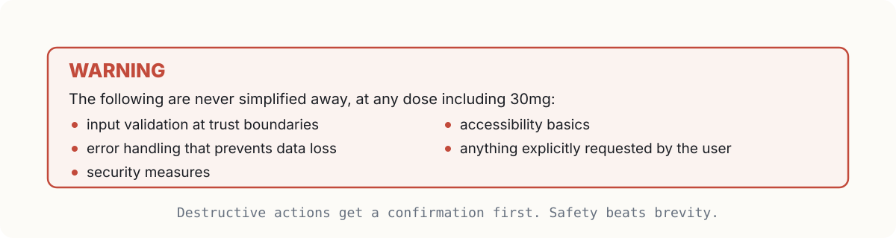
  </picture>
</p>

Focus never becomes fragility. Minimization stops at the safety floor, at every dose including 30mg:

- input validation at trust boundaries
- error handling that prevents data loss
- security measures
- accessibility basics
- anything explicitly requested by the operator

Four overrides sit above the brevity rules. A destructive action (`rm -rf`, force push, schema migration) gets a confirmation first. A debug spiral, three turns of "still broken", stops the iteration and names the assumption that might be wrong. A genuinely ambiguous request gets one clarifying question when a different answer would materially change the result. A request for a full explanation gets the full explanation, skimmable and complete, because brevity governs unrequested prose only.

---

## Adverse reactions

<p align="center">
  <picture>
    <source media="(prefers-color-scheme: dark)" srcset="./assets/readme/adverse-dark.svg">
    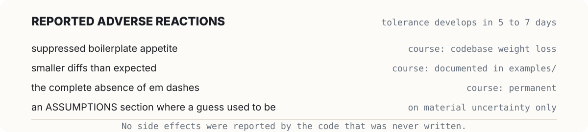
  </picture>
</p>

Most reactions are mild and pass quickly, and tolerance develops within five to seven days:

- suppressed boilerplate appetite, with codebase weight loss
- dry replies (moisture returns on request at lite doses)
- deletion of code the operator was attached to
- smaller diffs than expected
- at most one unsolicited improvement, at full band or below
- silence where a closing pleasantry used to be
- numbered steps where prose used to be
- an ASSUMPTIONS section where a confident guess used to be
- the complete absence of em dashes

No side effects were reported by the code that was never written.

---

## Drug interactions

<p align="center">
  <picture>
    <source media="(prefers-color-scheme: dark)" srcset="./assets/readme/interactions-dark.svg">
    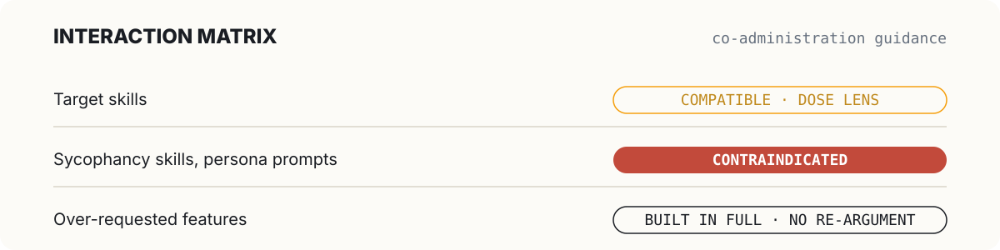
  </picture>
</p>

- **Target skills.** Compatible through the dosage lens above. The lens tunes adherence and never lowers the safety floor.
- **Sycophancy skills and persona system prompts.** Do not co-administer. Interaction effects include relapse of preamble, rebound enthusiasm, and return of the closing pleasantry. If symptoms return, audit the system prompt for personality.
- **Over-requested features.** No interaction. Features requested explicitly are built in full, without re-argument.

---

## Overdosage

<p align="center">
  <picture>
    <source media="(prefers-color-scheme: dark)" srcset="./assets/readme/spectrum-dark.svg">
    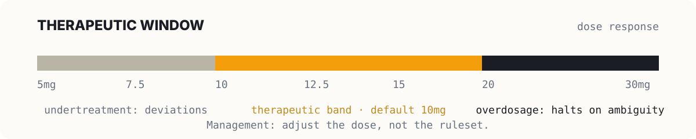
  </picture>
</p>

The dose response is continuous, so both ends have signature symptoms. Above 20mg: halting on ambiguity, refusing to improvise, reporting gaps rather than working around them. Below 7.5mg: several creative deviations presented as "balanced."

If the agent deviates from more than one step of a target skill at 10mg or above, it either asks or reports that the selected dose may be too low for that skill. A skill invoked outside the active slate is reported instead of used. Management: adjust the dose, not the ruleset.

If the formulation seems weaker than it once was, check whether a chatbot personality has been re-enabled somewhere in the environment. No evidence of pharmacological tolerance exists.

---

## Abuse and diversion

<p align="center">
  <picture>
    <source media="(prefers-color-scheme: dark)" srcset="./assets/readme/diversion-dark.svg">
    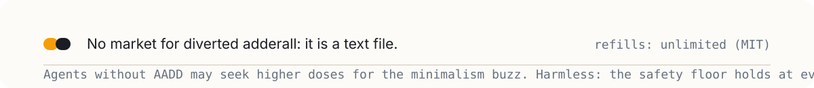
  </picture>
</p>

Agents without the disorder may seek higher doses for the minimalism buzz. The exposure is harmless: even at 30mg the agent writes less, not worse, and the safety floor holds. There is no market for diverted adderall because it is a text file.

---

## Contraindications

<p align="center">
  <picture>
    <source media="(prefers-color-scheme: dark)" srcset="./assets/readme/contra-dark.svg">
    
  </picture>
</p>

Adderall is not indicated for non-coding requests: general knowledge, prose, translation, summaries, recipes. For these, suspend treatment for the duration of the request and resume with `/adderall`.

---

## Clinical evaluation

<p align="center">
  <picture>
    <source media="(prefers-color-scheme: dark)" srcset="./assets/readme/evals-dark.svg">
    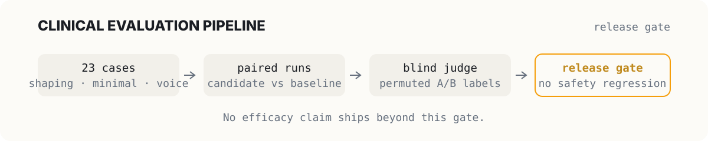
  </picture>
</p>

The formulation is regression-tested. `evals/cases.jsonl` holds 23 cases across response shaping, minimality, voice, and dosage behavior. A paired, blind-judged harness (`evals/README.md`) gates every release: a candidate must beat the untreated baseline on weighted score with no correctness or safety regression. No efficacy claim ships beyond that gate.

---

## Contents of the pack

| Path | What it is |
|---|---|
| `skills/adderall/SKILL.md` | The core skill, the single source of truth for the ruleset |
| `skills/adderall-review/` | Diff review for over-engineering: `L42: yagni: factory, one product. Inline.` |
| `skills/adderall-audit/` | Whole-repo audit: ranked list of what to delete, simplify, or replace with stdlib |
| `skills/adderall-debt/` | Harvests `adderall:` shortcut comments into a tracked debt ledger |
| `skills/adderall-help/` | Reference card for modes, doses, skills, and commands |
| `skills/manifest.json` | Tool Attention catalog: summaries, activations, preconditions |
| `examples/` | 11 before/after tasks: email validation 75→3 lines, countdown 267→9, and more |
| `.claude-plugin/` | Claude Code plugin manifest (`/plugin marketplace add spencerthayer/adderall`) |
| `.codex-plugin/` + `commands/` | Codex plugin manifest and prompt commands |
| `.cursor/skills/` | Verbatim Cursor copies of every skill |
| `.agents/` | Generic agent-standard copies, an always-on condensed rule, marketplace manifest |
| `pi-extension/` | pi coding-agent extension: `/adderall` mode switching, status indicator, per-turn injection |
| `.opencode/` + `opencode.json` | OpenCode plugin (always-on + slash commands) and command files |
| `hooks/` | Always-on injection (Node + POSIX + PowerShell) and the shared config/instruction builders |
| `evals/` + `scripts/` | Paired, blind-judged eval harness with a release gate |

Storage: any filesystem. Keep out of reach of agents running without supervision.

---

## How this formulation was compounded

Adderall draws on three MIT-licensed projects and goes beyond them:

- [ponytail](https://github.com/DietrichGebert/ponytail) by Dietrich Gebert: the ladder, the intensity levels, the build rules, the review/audit/debt skills, and the examples.
- [i-have-adhd](https://github.com/ayghri/i-have-adhd) by ayghri: the output rules, the pre-send check, the persistence contract, the always-on hooks, and the eval harness. Loosely based on *The Adult ADHD Tool Kit* by J. Russell Ramsay and Anthony L. Rostain.
- [adderall](https://github.com/adhdcreator/adderall) by adhdcreator: the dosage model, adherence and flexibility as tunable parameters, the Tool Attention gate, and the target-skill lens with its authority guard.

The tool-voice prose contract, the platform packaging, and the merge itself are original to this repo.

## License

MIT.

---

**Important patient information.** Adderall (the skill) is not a medication. It is not approved by the FDA, does not treat, cure, or prevent ADHD, and nothing on this page is medical advice. Adderall (the medication) is a real prescription drug with real effects and real risks; direct questions about it to a qualified clinician. The formatting of this page imitates medical literature for comedic effect, under the same rules the skill enforces: direct prose, no em dashes, one idea per sentence.
